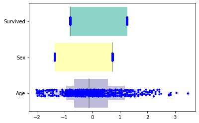
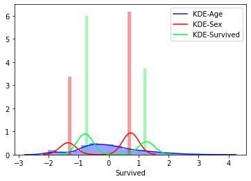
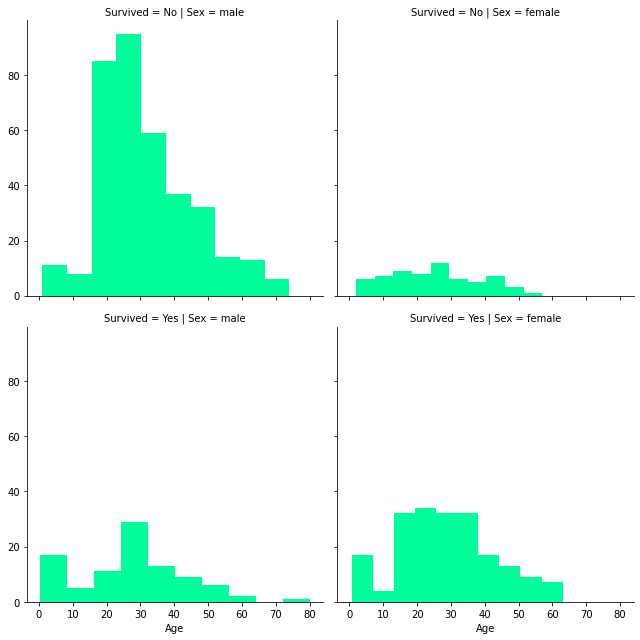

### <b>1 - Preprocessing part</b>

<b>First, we import pandas to read the csv file and do some transformation.</b><br>
<b>We can see the file which passed to the function is an Excel file, due to the inability to retrieve any data from the original csv file.</b><br>
<b>In the first step, we will take a look at some data with <em>head()</em> function to get an idea about the elements on the dataset.</b>


```python
import pandas as pd

df=pd.read_excel('titanic-passengers.xlsx')
df.head(15)
```


<div>
<style scoped>
    .dataframe tbody tr th:only-of-type {
        vertical-align: middle;
    }

    .dataframe tbody tr th {
        vertical-align: top;
    }

    .dataframe thead th {
        text-align: right;
    }
</style>
<table border="1" class="dataframe">
  <thead>
    <tr style="text-align: right;">
      <th></th>
      <th>PassengerId</th>
      <th>Survived</th>
      <th>Pclass</th>
      <th>Name</th>
      <th>Sex</th>
      <th>Age</th>
      <th>SibSp</th>
      <th>Parch</th>
      <th>Ticket</th>
      <th>Fare</th>
      <th>Cabin</th>
      <th>Embarked</th>
    </tr>
  </thead>
  <tbody>
    <tr>
      <th>0</th>
      <td>343</td>
      <td>No</td>
      <td>2</td>
      <td>Collander, Mr. Erik Gustaf</td>
      <td>male</td>
      <td>28.0</td>
      <td>0</td>
      <td>0</td>
      <td>248740</td>
      <td>13.0000</td>
      <td>NaN</td>
      <td>S</td>
    </tr>
    <tr>
      <th>1</th>
      <td>76</td>
      <td>No</td>
      <td>3</td>
      <td>Moen, Mr. Sigurd Hansen</td>
      <td>male</td>
      <td>25.0</td>
      <td>0</td>
      <td>0</td>
      <td>348123</td>
      <td>7.6500</td>
      <td>F G73</td>
      <td>S</td>
    </tr>
    <tr>
      <th>2</th>
      <td>641</td>
      <td>No</td>
      <td>3</td>
      <td>Jensen, Mr. Hans Peder</td>
      <td>male</td>
      <td>20.0</td>
      <td>0</td>
      <td>0</td>
      <td>350050</td>
      <td>7.8542</td>
      <td>NaN</td>
      <td>S</td>
    </tr>
    <tr>
      <th>3</th>
      <td>568</td>
      <td>No</td>
      <td>3</td>
      <td>Palsson, Mrs. Nils (Alma Cornelia Berglund)</td>
      <td>female</td>
      <td>29.0</td>
      <td>0</td>
      <td>4</td>
      <td>349909</td>
      <td>21.0750</td>
      <td>NaN</td>
      <td>S</td>
    </tr>
    <tr>
      <th>4</th>
      <td>672</td>
      <td>No</td>
      <td>1</td>
      <td>Davidson, Mr. Thornton</td>
      <td>male</td>
      <td>31.0</td>
      <td>1</td>
      <td>0</td>
      <td>F.C. 12750</td>
      <td>52.0000</td>
      <td>B71</td>
      <td>S</td>
    </tr>
    <tr>
      <th>5</th>
      <td>105</td>
      <td>No</td>
      <td>3</td>
      <td>Gustafsson, Mr. Anders Vilhelm</td>
      <td>male</td>
      <td>37.0</td>
      <td>2</td>
      <td>0</td>
      <td>3101276</td>
      <td>7.9250</td>
      <td>NaN</td>
      <td>S</td>
    </tr>
    <tr>
      <th>6</th>
      <td>576</td>
      <td>No</td>
      <td>3</td>
      <td>Patchett, Mr. George</td>
      <td>male</td>
      <td>19.0</td>
      <td>0</td>
      <td>0</td>
      <td>358585</td>
      <td>14.5000</td>
      <td>NaN</td>
      <td>S</td>
    </tr>
    <tr>
      <th>7</th>
      <td>382</td>
      <td>Yes</td>
      <td>3</td>
      <td>Nakid, Miss. Maria ("Mary")</td>
      <td>female</td>
      <td>1.0</td>
      <td>0</td>
      <td>2</td>
      <td>2653</td>
      <td>15.7417</td>
      <td>NaN</td>
      <td>C</td>
    </tr>
    <tr>
      <th>8</th>
      <td>228</td>
      <td>No</td>
      <td>3</td>
      <td>Lovell, Mr. John Hall ("Henry")</td>
      <td>male</td>
      <td>20.5</td>
      <td>0</td>
      <td>0</td>
      <td>A/5 21173</td>
      <td>7.2500</td>
      <td>NaN</td>
      <td>S</td>
    </tr>
    <tr>
      <th>9</th>
      <td>433</td>
      <td>Yes</td>
      <td>2</td>
      <td>Louch, Mrs. Charles Alexander (Alice Adelaide ...</td>
      <td>female</td>
      <td>42.0</td>
      <td>1</td>
      <td>0</td>
      <td>SC/AH 3085</td>
      <td>26.0000</td>
      <td>NaN</td>
      <td>S</td>
    </tr>
    <tr>
      <th>10</th>
      <td>135</td>
      <td>No</td>
      <td>2</td>
      <td>Sobey, Mr. Samuel James Hayden</td>
      <td>male</td>
      <td>25.0</td>
      <td>0</td>
      <td>0</td>
      <td>C.A. 29178</td>
      <td>13.0000</td>
      <td>NaN</td>
      <td>S</td>
    </tr>
    <tr>
      <th>11</th>
      <td>294</td>
      <td>No</td>
      <td>3</td>
      <td>Haas, Miss. Aloisia</td>
      <td>female</td>
      <td>24.0</td>
      <td>0</td>
      <td>0</td>
      <td>349236</td>
      <td>8.8500</td>
      <td>NaN</td>
      <td>S</td>
    </tr>
    <tr>
      <th>12</th>
      <td>755</td>
      <td>Yes</td>
      <td>2</td>
      <td>Herman, Mrs. Samuel (Jane Laver)</td>
      <td>female</td>
      <td>48.0</td>
      <td>1</td>
      <td>2</td>
      <td>220845</td>
      <td>65.0000</td>
      <td>NaN</td>
      <td>S</td>
    </tr>
    <tr>
      <th>13</th>
      <td>595</td>
      <td>No</td>
      <td>2</td>
      <td>Chapman, Mr. John Henry</td>
      <td>male</td>
      <td>37.0</td>
      <td>1</td>
      <td>0</td>
      <td>SC/AH 29037</td>
      <td>26.0000</td>
      <td>NaN</td>
      <td>S</td>
    </tr>
    <tr>
      <th>14</th>
      <td>127</td>
      <td>No</td>
      <td>3</td>
      <td>McMahon, Mr. Martin</td>
      <td>male</td>
      <td>NaN</td>
      <td>0</td>
      <td>0</td>
      <td>370372</td>
      <td>7.7500</td>
      <td>NaN</td>
      <td>Q</td>
    </tr>
  </tbody>
</table>
</div>


<b>Next step, we will get some info about the type of elements composing each column and the number of non-null ones.</b>


```python
df.info()
```

    <class 'pandas.core.frame.DataFrame'>
    RangeIndex: 891 entries, 0 to 890
    Data columns (total 12 columns):
     #   Column       Non-Null Count  Dtype  
    ---  ------       --------------  -----  
     0   PassengerId  891 non-null    int64  
     1   Survived     891 non-null    object 
     2   Pclass       891 non-null    int64  
     3   Name         891 non-null    object 
     4   Sex          891 non-null    object 
     5   Age          714 non-null    float64
     6   SibSp        891 non-null    int64  
     7   Parch        891 non-null    int64  
     8   Ticket       891 non-null    object 
     9   Fare         891 non-null    float64
     10  Cabin        204 non-null    object 
     11  Embarked     889 non-null    object 
    dtypes: float64(2), int64(4), object(6)
    memory usage: 83.7+ KB
    

<b>On this step, we will pick-up the number of null elements ( Nan element ) on each column, so we can deal with them ( replace or drop regarding the importance of the features).</b>


```python
df.isnull().sum()
```


    PassengerId      0
    Survived         0
    Pclass           0
    Name             0
    Sex              0
    Age            177
    SibSp            0
    Parch            0
    Ticket           0
    Fare             0
    Cabin          687
    Embarked         2
    dtype: int64


<b>first, we use the function describe() on each of the 3 columns ( "Age", "Cabin" and "Embarked" ) to get some info so we can replace the NaN values.</b><br>
<b>After gathering some info, we use the function fillna() to replace the NaN values with specific ones. Then we verify if there is no more missing value.</b>


```python
df['Age'].describe()
```


    count    714.000000
    mean      29.699118
    std       14.526497
    min        0.420000
    25%       20.125000
    50%       28.000000
    75%       38.000000
    max       80.000000
    Name: Age, dtype: float64


<b>mean_age is the average age value of all passengers ages</b>


```python
mean_age=round(df['Age'].mean())
mean_age
```


    30


```python
df['Age'].fillna(mean_age, inplace=True)
df['Age'].isnull().sum()
```


    0


<b>The next code line output different value from the one i did choose to replace with it the missing value</b><br>
<b>i did choose different value because that value will not disturb our work.<b>


```python
df["Cabin"].describe()
```


    count             204
    unique            147
    top       C23 C25 C27
    freq                4
    Name: Cabin, dtype: object


```python
df["Cabin"].fillna("G6",inplace=True)
df["Cabin"].isnull().sum()
```


    0


```python
df["Embarked"].describe()
```


    count     889
    unique      3
    top         S
    freq      644
    Name: Embarked, dtype: object


```python
df['Embarked'].fillna('S', inplace=True)
df["Embarked"].isnull().sum()
```


    0


<b>In this last step, we verify over the all data frame if there is no more missing values with the 2 functions isnull() and info()</b>


```python
df.isnull().sum()
```


    PassengerId    0
    Survived       0
    Pclass         0
    Name           0
    Sex            0
    Age            0
    SibSp          0
    Parch          0
    Ticket         0
    Fare           0
    Cabin          0
    Embarked       0
    dtype: int64


```python
df.info()
```

    <class 'pandas.core.frame.DataFrame'>
    RangeIndex: 891 entries, 0 to 890
    Data columns (total 12 columns):
     #   Column       Non-Null Count  Dtype  
    ---  ------       --------------  -----  
     0   PassengerId  891 non-null    int64  
     1   Survived     891 non-null    object 
     2   Pclass       891 non-null    int64  
     3   Name         891 non-null    object 
     4   Sex          891 non-null    object 
     5   Age          891 non-null    float64
     6   SibSp        891 non-null    int64  
     7   Parch        891 non-null    int64  
     8   Ticket       891 non-null    object 
     9   Fare         891 non-null    float64
     10  Cabin        891 non-null    object 
     11  Embarked     891 non-null    object 
    dtypes: float64(2), int64(4), object(6)
    memory usage: 83.7+ KB
    

<b>For exemple, we can encode the column "survived" no become 0 and yes will be 1 like we see on the cell below, </b><br>
<b>we do that because when we will build the AI model, it will get as input only numerical values not string.</b>


```python
from sklearn.preprocessing import LabelEncoder
encoder = LabelEncoder()
new_df=df['Survived']
new_df=encoder.fit_transform(new_df)
new_df
```


    array([0, 0, 0, 0, 0, 0, 0, 1, 0, 1, 0, 0, 1, 0, 0, 0, 0, 0, 0, 1, 1, 0,
           1, 0, 1, 0, 1, 1, 0, 0, 0, 0, 0, 0, 1, 0, 0, 1, 0, 1, 1, 0, 0, 0,
           0, 1, 0, 0, 0, 0, 0, 0, 1, 1, 1, 0, 0, 0, 0, 0, 1, 0, 1, 1, 0, 0,
           0, 0, 0, 1, 0, 1, 1, 1, 0, 0, 1, 0, 1, 1, 0, 0, 1, 0, 0, 0, 0, 1,
           0, 0, 1, 1, 1, 0, 0, 0, 0, 0, 1, 0, 0, 0, 0, 1, 0, 0, 0, 0, 0, 0,
           1, 1, 0, 0, 1, 0, 0, 1, 0, 0, 0, 0, 0, 1, 1, 0, 1, 0, 1, 0, 0, 1,
           0, 0, 1, 0, 0, 1, 0, 1, 1, 1, 0, 1, 1, 1, 1, 1, 0, 0, 0, 0, 0, 0,
           0, 0, 0, 0, 0, 0, 0, 0, 1, 1, 1, 0, 1, 0, 1, 1, 0, 0, 0, 0, 1, 0,
           0, 1, 0, 0, 0, 0, 0, 1, 1, 0, 0, 0, 1, 1, 1, 1, 1, 1, 1, 0, 0, 0,
           0, 0, 0, 1, 0, 0, 0, 0, 0, 1, 0, 0, 0, 1, 0, 0, 0, 1, 0, 0, 1, 0,
           1, 1, 0, 1, 1, 0, 1, 0, 1, 0, 0, 0, 0, 1, 0, 1, 0, 0, 1, 1, 0, 0,
           0, 1, 1, 1, 0, 0, 1, 0, 0, 0, 0, 1, 0, 1, 0, 1, 1, 0, 1, 0, 0, 0,
           0, 1, 0, 1, 1, 0, 0, 1, 1, 1, 0, 1, 0, 1, 1, 1, 1, 1, 0, 0, 1, 0,
           1, 0, 0, 1, 0, 0, 0, 0, 0, 1, 1, 1, 1, 1, 0, 0, 0, 0, 1, 0, 0, 0,
           1, 0, 0, 1, 0, 0, 0, 0, 0, 0, 0, 1, 1, 0, 0, 1, 1, 1, 1, 0, 0, 0,
           1, 0, 0, 0, 0, 0, 1, 0, 0, 0, 0, 0, 0, 0, 0, 0, 1, 0, 0, 0, 0, 0,
           1, 1, 0, 0, 0, 0, 1, 0, 1, 1, 0, 1, 0, 0, 0, 1, 1, 0, 0, 0, 1, 1,
           0, 0, 1, 0, 1, 1, 0, 0, 0, 0, 1, 0, 1, 1, 0, 0, 0, 0, 0, 1, 0, 1,
           1, 0, 1, 1, 1, 0, 0, 0, 0, 0, 0, 0, 1, 0, 0, 1, 1, 1, 1, 1, 0, 1,
           0, 0, 0, 1, 0, 0, 1, 0, 1, 0, 1, 0, 0, 1, 1, 0, 0, 0, 0, 0, 0, 1,
           0, 1, 0, 1, 0, 1, 1, 0, 1, 0, 1, 1, 0, 0, 1, 0, 1, 0, 0, 1, 0, 0,
           0, 0, 0, 1, 1, 1, 0, 1, 1, 0, 1, 1, 0, 1, 0, 0, 1, 0, 1, 1, 1, 1,
           1, 0, 1, 0, 1, 1, 0, 0, 1, 1, 0, 1, 0, 1, 1, 1, 1, 1, 0, 0, 0, 1,
           1, 0, 1, 0, 1, 0, 0, 1, 0, 0, 0, 0, 1, 0, 0, 0, 0, 0, 0, 1, 0, 0,
           0, 0, 0, 0, 0, 0, 0, 1, 1, 1, 0, 1, 0, 0, 0, 0, 1, 0, 0, 0, 0, 0,
           0, 0, 0, 0, 0, 1, 0, 1, 1, 0, 0, 0, 1, 1, 0, 0, 0, 0, 0, 0, 1, 1,
           0, 0, 0, 1, 0, 1, 0, 0, 0, 0, 1, 1, 0, 1, 0, 0, 0, 0, 0, 0, 0, 1,
           1, 1, 0, 1, 0, 1, 0, 1, 0, 1, 1, 0, 0, 1, 1, 0, 0, 0, 0, 1, 1, 0,
           1, 0, 0, 0, 1, 0, 0, 0, 1, 0, 0, 0, 1, 1, 1, 1, 0, 0, 1, 1, 0, 1,
           0, 0, 1, 0, 0, 1, 0, 0, 0, 0, 0, 0, 0, 0, 1, 0, 0, 0, 1, 1, 0, 1,
           1, 1, 0, 0, 0, 0, 0, 0, 0, 1, 0, 0, 0, 0, 1, 0, 0, 1, 1, 0, 0, 0,
           1, 0, 0, 0, 0, 0, 0, 0, 1, 0, 1, 1, 1, 1, 0, 1, 1, 1, 1, 0, 1, 1,
           0, 0, 0, 0, 0, 0, 0, 0, 0, 1, 1, 0, 1, 0, 0, 1, 0, 0, 1, 1, 0, 1,
           0, 1, 0, 0, 0, 1, 1, 1, 0, 1, 0, 1, 1, 1, 0, 0, 0, 0, 1, 0, 1, 0,
           1, 0, 0, 0, 1, 1, 0, 1, 1, 1, 0, 0, 0, 0, 1, 1, 1, 1, 0, 0, 0, 0,
           1, 0, 0, 0, 0, 1, 0, 0, 1, 0, 0, 1, 0, 1, 0, 1, 1, 0, 1, 0, 0, 1,
           1, 1, 0, 1, 1, 1, 0, 1, 0, 1, 0, 0, 0, 1, 1, 0, 0, 1, 1, 1, 0, 0,
           0, 0, 0, 1, 1, 1, 1, 0, 1, 0, 1, 0, 0, 1, 0, 0, 1, 0, 1, 0, 0, 1,
           0, 0, 0, 0, 0, 1, 0, 1, 1, 0, 0, 1, 1, 0, 0, 0, 0, 0, 0, 0, 1, 1,
           1, 0, 0, 0, 1, 1, 0, 1, 0, 0, 0, 0, 0, 0, 0, 0, 0, 0, 0, 0, 1, 1,
           1, 0, 1, 0, 0, 0, 1, 0, 0, 0, 1])


### <b>2 - Visualization part<b>

<b>We start with importing matplotlib and seaborn wiche will we will need for ploting </b>


```python
import matplotlib.pyplot as plt
import seaborn as sns
```

<b>a - distribution of the most important features based on my understanding of the dataset</b>
here we will use 2 types of ploting so we can  


```python
from sklearn.preprocessing import LabelEncoder
from sklearn.preprocessing import StandardScaler

encoder=LabelEncoder()
scaler=StandardScaler()

newdf1=df.drop(["PassengerId",'Pclass',"Name","SibSp","Parch","Ticket","Fare","Cabin","Embarked"],axis=1)

newdf1['Survived']=encoder.fit_transform(newdf1['Survived'])
newdf1['Sex']=encoder.fit_transform(newdf1['Sex'])

newdf1['Age']=scaler.fit_transform(newdf1['Age'].values.reshape(-1, 1))
newdf1['Sex']=scaler.fit_transform(newdf1['Sex'].values.reshape(-1, 1))
newdf1['Survived']=scaler.fit_transform(newdf1['Survived'].values.reshape(-1, 1))

sns.boxenplot(data=newdf1,orient="h",palette="Set3",saturation=1)
sns.stripplot(data=newdf1,orient="h",size=4, color="blue")
```


    <matplotlib.axes._subplots.AxesSubplot at 0x23184d7f588>





```python
sns.distplot(newdf1["Age"],bins=20,hist=True,kde=True,color="#001BFF",kde_kws={"label":"KDE-Age"})
sns.distplot(newdf1["Sex"],bins=20,hist=True,kde=True,color="#FF0000",kde_kws={"label":"KDE-Sex"})
sns.distplot(newdf1["Survived"],bins=20,hist=True,kde=True,color="#00FF36",kde_kws={"label":"KDE-Survived"})
```


    <matplotlib.axes._subplots.AxesSubplot at 0x2318ddd2448>





<b>b - Correlation between Sex and Age concerning their importance in the survival of the individuals</b>


```python
newdf2=df.drop(["PassengerId","Pclass","Name","SibSp","Parch","Ticket","Fare","Cabin","Embarked"],axis=1)
grid =sns.FacetGrid(newdf2,row='Survived',col='Sex',height=4.5,aspect=1)
grid.map(plt.hist,'Age',color="#00FF9B")

```


    <seaborn.axisgrid.FacetGrid at 0x231901b0588>





<b>c - impact of Pclass and Fare on the survival of the individuals</b>


```python

```
